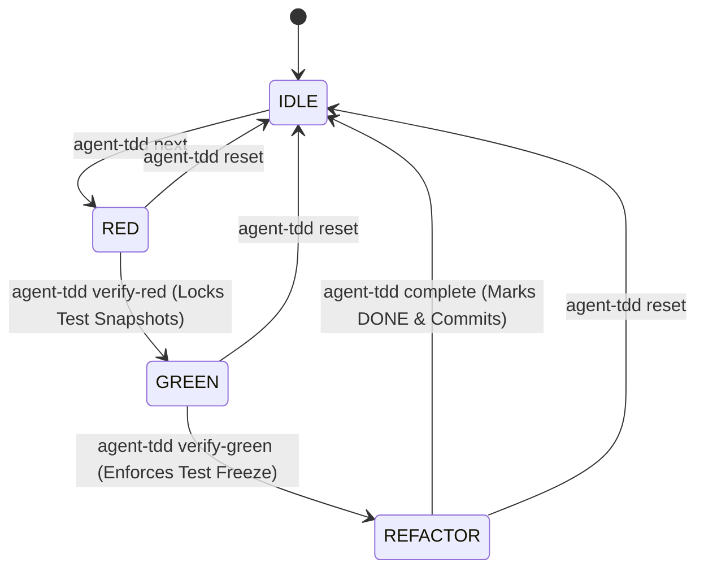

# 🤖 agent-tdd

> **TDD Harness & State Machine CLI for AI Agents & Developers**

`agent-tdd` is a command-line tool that enforces strict **Test-Driven Development (TDD)** state machine protocols. Designed specifically for AI coding assistants (such as Antigravity, Claude, ChatGPT, etc.) and human developers, `agent-tdd` ensures code is built using genuine **Red-Green-Refactor** discipline, preventing short-cuts, premature implementation, or test modification during implementation.

---

## ✨ Features

- 🔒 **Cryptographic Test Integrity Locking**: Snapshots test files in the `RED` phase and freezes them during `GREEN`. AI agents cannot modify failing tests to make them pass!
- 🚦 **State Machine Phase Gating**: Enforces linear transitions (`IDLE` ➔ `RED` ➔ `GREEN` ➔ `REFACTOR` ➔ `IDLE`). Skips and phase bypasses are rejected.
- 🌐 **Multi-Language Presets**: Auto-detects project stack and supports presets for:
  - **Dart** (`dart test`, `dart analyze`)
  - **Flutter** (`flutter test`, `flutter analyze`)
  - **Vitest / TypeScript** (`vitest`, `eslint`)
  - **Jest / JavaScript** (`jest`, `eslint`)
  - **Pytest / Python** (`pytest`, `flake8`)
  - **Go** (`go test`, `go vet`)
  - **Rust / Cargo** (`cargo test`, `cargo check`)
- 📋 **Spec Backlog Tracking**: Manage feature backlogs in `specs.yaml` or sync automatically with Markdown checklists (`specs.md`).
- 🤖 **Machine-Readable AI Output**: Outputs structured JSON by default with active states, file permissions (`read_only_files` vs `editable_files`), and exact next steps for AI agent prompt loops (pass `--no-json` for formatted terminal text logs).
- 🧹 **Static Analysis Verification**: Blocks completion if code contains linter warnings or analysis errors during the refactor phase.
- 📦 **Automated Git Micro-Commits**: Creates structured Git commits on phase transitions (`🔴 RED`, `🟢 GREEN`, `🎉 DONE`).

---

## 🚀 Installation & Setup

### Prerequisites
- [Dart SDK](https://dart.dev/get-dart) `>= 3.0.0`

### Build Executable
```bash
# Clone or navigate to directory
cd tdd_harness

# Activate globally or compile executable
dart compile exe bin/agent_tdd.dart -o agent-tdd
```

Or run via Dart directly:
```bash
dart run bin/agent_tdd.dart <command>
```

---

## 🏎️ Quick Start Guide

### 1. Initialize Project
Navigate to your target repository and initialize `agent-tdd`:
```bash
agent-tdd init
# Or explicitly select a runner preset:
agent-tdd init --runner=vitest
```
This generates `.tddrc.yaml` and `specs.yaml`.

### 2. Add Feature Specs
Add specs to your backlog via CLI or Markdown:
```bash
# Add single spec
agent-tdd specs add "Implement user authentication endpoint"

# Import backlog from markdown checklist
agent-tdd specs import TODO.md

# View spec backlog
agent-tdd specs list
```

### 3. Run TDD Cycle

#### Step 1: Pick Next Spec (`IDLE` ➔ `RED`)
```bash
agent-tdd next
```
*Transitions state machine to `RED`. Instructs to write only a failing unit test.*

#### Step 2: Verify RED Phase (`RED` ➔ `GREEN`)
Write your failing unit test, then run:
```bash
agent-tdd verify-red
```
*Verifies test failure on assertion. Cryptographically snapshot-locks test files and commits `🔴 RED` phase.*

#### Step 3: Verify GREEN Phase (`GREEN` ➔ `REFACTOR`)
Write minimal production code to make the test pass, then run:
```bash
agent-tdd verify-green
```
*Ensures test files were not modified (freeze check) and that all tests pass. Commits `🟢 GREEN` phase.*

#### Step 4: Verify REFACTOR Phase
Clean up implementation and test code, then run:
```bash
agent-tdd verify-refactor
```
*Runs 100% test suite pass check and static analysis/linter verification.*

#### Step 5: Complete Spec (`REFACTOR` ➔ `IDLE`)
```bash
agent-tdd complete
```
*Marks spec as `DONE`, creates Git commit `🎉 DONE (spec-X)`, resets state machine to `IDLE` for the next task.*

---

## 📖 CLI Commands Reference

| Command | Alias | Description |
| :--- | :--- | :--- |
| `agent-tdd init` | - | Initializes configuration (`.tddrc.yaml`) and backlog (`specs.yaml`). |
| `agent-tdd specs [list]` | - | Displays current feature specs backlog & status summary. |
| `agent-tdd specs add "<title>"` | - | Appends a new pending spec to the backlog. |
| `agent-tdd specs import <file.md>` | - | Imports pending (`- [ ]`) and done (`- [x]`) items from Markdown. |
| `agent-tdd next` | - | Selects next pending spec and enters `RED` phase. |
| `agent-tdd verify-red` | `red` | Verifies test failure, snapshot-locks test files, advances to `GREEN`. |
| `agent-tdd verify-green` | `green` | Enforces test freeze integrity & test pass, advances to `REFACTOR`. |
| `agent-tdd verify-refactor` | `refactor` | Verifies tests pass with 0 static analysis / linter issues. |
| `agent-tdd complete` | `done` | Marks spec `DONE`, commits changes, resets state machine to `IDLE`. |
| `agent-tdd status` | - | Prints dashboard with active phase, spec details, and progress summary. |
| `agent-tdd reset` | - | Resets state machine and unlocks frozen snapshots back to `IDLE`. |

### Global Flags

- `-j`, `--json`: Outputs machine-readable JSON format for AI agent integrations.
- `-d`, `--project-dir <path>`: Specifies target project directory (defaults to current directory).
- `-h`, `--help`: Prints usage documentation.

---

## ⚙️ Configuration (`.tddrc.yaml`)

When initializing, `agent-tdd` auto-detects your workspace or creates `.tddrc.yaml`:

```yaml
runner: dart
test_command: dart test
analyze_command: dart analyze
test_files: test/**/*_test.dart
source_files: lib/**/*.dart
fail_on_warnings: true
git_commit: true
```

### Supported Presets

| Preset | Test Command | Analysis Command | Test File Pattern | Source File Pattern |
| :--- | :--- | :--- | :--- | :--- |
| **`dart`** | `dart test` | `dart analyze` | `test/**/*_test.dart` | `lib/**/*.dart` |
| **`flutter`**| `flutter test` | `flutter analyze` | `test/**/*_test.dart` | `lib/**/*.dart` |
| **`vitest`** | `npx vitest run` | `npx eslint . --max-warnings 0` | `src/**/*.test.ts` | `src/**/*.ts` |
| **`jest`** | `npx jest` | `npx eslint . --max-warnings 0` | `src/**/*.test.js` | `src/**/*.js` |
| **`pytest`** | `pytest` | `flake8` | `tests/**/test_*.py` | `src/**/*.py` |
| **`go`** | `go test ./...` | `go vet ./...` | `**/*_test.go` | `**/*.go` |
| **`cargo`** | `cargo test` | `cargo check` | `tests/**/*.rs` | `src/**/*.rs` |

---

## 🤖 AI Agent Workflow Integration

`agent-tdd` includes a standard system prompt template located in [`templates/TDD_WORKFLOW.md`](file:///home/mahmoud/Documents/Projects/tdd_harness/templates/TDD_WORKFLOW.md).

### JSON Output Schema for AI Agents (Default)

Every command returns actionable JSON feedback by default (use `--no-json` for formatted terminal text output):

```json
{
  "success": true,
  "phase": "GREEN",
  "active_spec": {
    "id": 1,
    "title": "Implement user authentication endpoint"
  },
  "allowed_actions": {
    "editable_files": ["lib/**/*.dart"],
    "read_only_files": ["test/**/*_test.dart"],
    "next_command": "agent-tdd verify-green"
  },
  "instructions_for_agent": "Test failed as expected. Test files are cryptographically FROZEN. Write minimal production code in lib/**/*.dart to pass the test. Run \"agent-tdd verify-green\" when done."
}
```

---

## 🔄 State Machine Lifecycle



---

## 🧪 Running Tests

To run internal unit tests for `agent-tdd`:

```bash
dart test
```

---

## 📄 License

MIT License.
